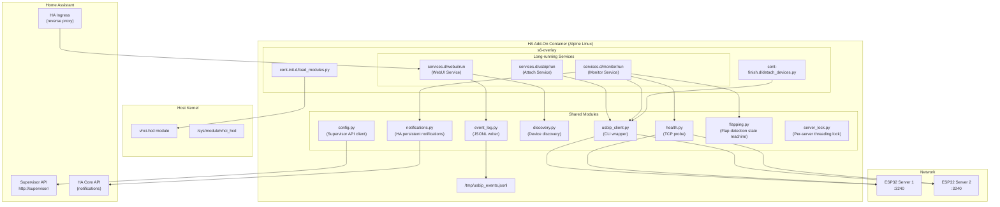
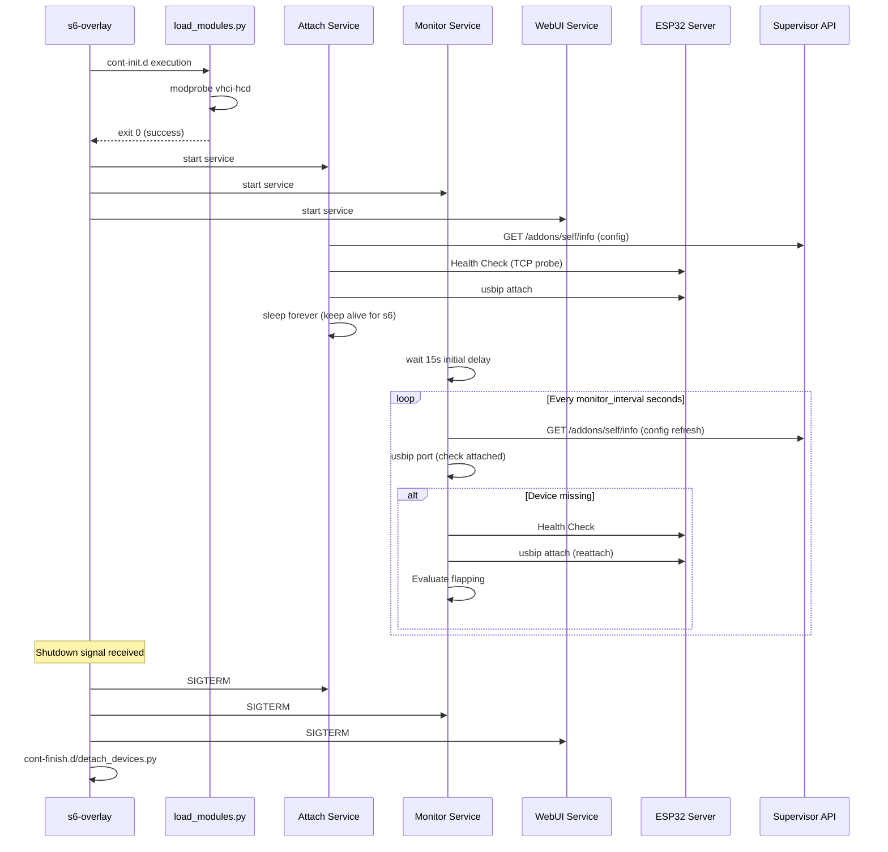

# Design Document

## Overview

This document describes the technical design for the **ha-usbip-esp32-client** Home Assistant add-on. The add-on acts as a USB/IP client that attaches remote USB devices exposed by ESP32-S3 devices running the ESPHome USB/IP server component, making them available as local USB devices on the Home Assistant host.

The system uses three long-running s6-overlay services:
1. **Attach Service** — performs initial USB device attachment at startup
2. **Monitor Service** — polls device status and reattaches lost devices
3. **WebUI Service** — Flask-based web interface for status monitoring and management

All services are Python-based, coordinating through the `usbip` CLI tool and sharing state via a JSONL event log. Configuration is read from the Home Assistant Supervisor API, and notifications are delivered via persistent notifications.

### Key Design Decisions

| Decision | Rationale |
|----------|-----------|
| Python for all services | Consistent with HA add-on ecosystem; rich stdlib for subprocess, socket, JSON, logging |
| `usbip` CLI over kernel API | Well-tested userspace tool; avoids fragile kernel ABI coupling |
| JSONL event log at `/tmp` | Simple append-only format; tmpfs avoids SD card wear; survives service restarts within same container run |
| Polling WebUI (no WebSocket) | Eliminates gevent/eventlet dependencies; simpler deployment; HA Ingress fully supports standard HTTP |
| Per-server locking | ESP32 supports only one TCP client at a time; serializes Discovery/Health/Attach per server |
| s6-overlay service supervision | HA add-on standard; automatic restart on crash; clean lifecycle hooks |

## Architecture



### Service Lifecycle



## Components and Interfaces

### 1. Configuration Module (`config.py`)

Responsible for reading and caching add-on configuration from the Supervisor API.

```python
class AddonConfig:
    """Reads configuration from HA Supervisor API."""
    
    SUPERVISOR_URL = "http://supervisor"
    
    def __init__(self):
        self.token: str  # from SUPERVISOR_TOKEN env var
        self._cache: Optional[dict] = None
        self._cache_time: float = 0
    
    def read_config(self, retries: int = 3, delay: float = 5.0) -> dict:
        """GET /addons/self/info, extract options. Retries on failure."""
        ...
    
    @property
    def devices(self) -> List[DeviceEntry]:
        """Parsed and validated device entries."""
        ...
    
    @property
    def monitor_interval(self) -> int: ...
    @property
    def reattach_retries(self) -> int: ...
    @property
    def attach_delay(self) -> int: ...
    @property
    def log_level(self) -> str: ...
    @property
    def notifications_enabled(self) -> bool: ...
    @property
    def flap_warning_threshold(self) -> int: ...
    @property
    def flap_critical_threshold(self) -> int: ...
    @property
    def flap_window_seconds(self) -> int: ...
    @property
    def flap_clear_seconds(self) -> int: ...
```

### 2. USB/IP Client Module (`usbip_client.py`)

Wraps the `usbip` CLI commands with structured return values.

```python
@dataclass
class AttachResult:
    success: bool
    port: Optional[int]  # assigned VHCI port on success
    stderr: str
    
@dataclass  
class PortEntry:
    port: int
    server: str
    busid: str
    device_info: str

class UsbipClient:
    """Wrapper around the usbip CLI tool."""
    
    def attach(self, server: str, busid: str = "1-1", 
               port: Optional[int] = None) -> AttachResult:
        """Execute usbip attach --remote=<server> --busid=<busid>"""
        ...
    
    def detach(self, port: int) -> bool:
        """Execute usbip detach --port=<port>"""
        ...
    
    def detach_remote(self, server: str, busid: str) -> bool:
        """Execute usbip detach -r <server> -b <busid> (pre-detach)"""
        ...
    
    def list_ports(self) -> List[PortEntry]:
        """Execute usbip port and parse output."""
        ...
    
    def remount_sysfs(self) -> bool:
        """Execute mount -o remount -t sysfs sysfs /sys"""
        ...
```

### 3. Health Check Module (`health.py`)

Simple TCP connection probe for ESP32 server reachability.

```python
class HealthChecker:
    """TCP probe to verify ESP32 server reachability."""
    
    def check(self, server: str, port: int = 3240, 
              timeout: float = 2.0) -> HealthResult:
        """
        Attempt TCP connection. Returns HealthResult with 
        success status and latency_ms.
        """
        ...

@dataclass
class HealthResult:
    reachable: bool
    latency_ms: Optional[float]
    error: Optional[str]
```

### 4. Discovery Module (`discovery.py`)

Runs `usbip list -r` and parses ESP32-specific output format.

```python
@dataclass
class DiscoveredDevice:
    busid: str
    manufacturer: str
    product: str

class DeviceDiscovery:
    """Discovers USB devices on ESP32 servers via usbip list."""
    
    DEVICE_PATTERN = re.compile(
        r'^\s*(\S+):\s*(.+?)\s*:\s*(.+?)\s*$'
    )
    TIMEOUT = 10  # seconds
    
    def discover(self, server: str, port: Optional[int] = None) -> DiscoveryResult:
        """Execute usbip list -r <server> and parse output."""
        ...

@dataclass
class DiscoveryResult:
    success: bool
    devices: List[DiscoveredDevice]
    error: Optional[str]
```

### 5. Event Log Module (`event_log.py`)

Manages the JSONL event file with rotation.

```python
class EventLog:
    """Append-only JSONL event logger with 200-event rotation."""
    
    PATH = "/tmp/usbip_events.jsonl"
    MAX_EVENTS = 200
    
    VALID_TYPES = {
        "attach_ok", "attach_fail", "detach_ok", "detach_fail",
        "device_lost", "device_recovered", "reattach_attempt",
        "reattach_ok", "reattach_fail", "flap_warning", 
        "flap_critical", "flap_cleared", "discover"
    }
    
    def record(self, event_type: str, device: str, 
               server: str, detail: str) -> None:
        """Append event, truncate if over MAX_EVENTS."""
        ...
    
    def read_events(self, limit: int = 200) -> List[dict]:
        """Read events in reverse chronological order."""
        ...
    
    def _truncate_if_needed(self) -> None:
        """Keep only most recent MAX_EVENTS entries."""
        ...
```

### 6. Notifications Module (`notifications.py`)

Sends persistent notifications via HA API with cooldown tracking.

```python
class NotificationManager:
    """Sends HA persistent notifications with per-device cooldown."""
    
    COOLDOWN_SECONDS = 300
    ENDPOINT = "/core/api/services/persistent_notification/create"
    
    def __init__(self, config: AddonConfig):
        self._config = config
        self._last_sent: Dict[str, float] = {}  # device_key -> monotonic time
    
    def notify_device_lost(self, device_name: str, server: str) -> None:
        """Send loss notification if not in cooldown and enabled."""
        ...
    
    def notify_device_recovered(self, device_name: str, server: str) -> None:
        """Send recovery notification if not in cooldown and enabled."""
        ...
    
    def notify_reattach_failed(self, device_name: str, server: str) -> None:
        """Send manual intervention required notification."""
        ...
    
    def notify_flapping(self, device_name: str, server: str, 
                        level: str, count: int) -> None:
        """Send flapping warning/critical notification."""
        ...
```

### 7. Flapping Detection Module (`flapping.py`)

State machine tracking recovery events per device.

```python
class FlappingState(Enum):
    NONE = "none"
    WARNING = "warning"
    CRITICAL = "critical"

@dataclass
class DeviceFlappingTracker:
    recovery_timestamps: List[float]  # monotonic timestamps
    state: FlappingState
    last_recovery: Optional[float]

class FlappingDetector:
    """Per-device flapping state machine."""
    
    def __init__(self, config: AddonConfig):
        self._config = config
        self._trackers: Dict[str, DeviceFlappingTracker] = {}
    
    def record_recovery(self, device_key: str) -> None:
        """Record a recovery event timestamp."""
        ...
    
    def evaluate(self, device_key: str) -> Optional[FlappingState]:
        """
        Evaluate flapping state. Returns new state only on 
        upward transition (None means no transition occurred).
        """
        ...
    
    def check_clear(self, device_key: str) -> bool:
        """Check if device has been stable long enough to clear."""
        ...
```

### 8. Server Lock Module (`server_lock.py`)

Per-server mutex to prevent concurrent ESP32 access.

```python
class ServerLockManager:
    """Per-server threading locks for ESP32 single-connection constraint."""
    
    def __init__(self):
        self._locks: Dict[str, threading.Lock] = {}
        self._meta_lock = threading.Lock()
    
    def acquire(self, server: str) -> None:
        """Acquire lock for server (blocking)."""
        ...
    
    def release(self, server: str) -> None:
        """Release lock for server."""
        ...
    
    @contextmanager
    def lock(self, server: str):
        """Context manager for server lock."""
        ...
```

### 9. WebUI Service (`webui_app.py`)

Flask application serving the web interface and API endpoints.

```python
app = Flask(__name__)

# Pages
@app.route("/")           # Dashboard
@app.route("/devices")    # Device list
@app.route("/logs")       # Log viewer
@app.route("/events")     # Event timeline

# API endpoints
@app.route("/api/status")              # GET - device status + health
@app.route("/api/attach", methods=["POST"])   # POST - attach by server
@app.route("/api/detach", methods=["POST"])   # POST - detach by port
@app.route("/api/discover")            # GET - discovery for server
@app.route("/api/events")              # GET - event log entries
@app.route("/api/logs")                # GET - supervisor logs

# Ingress support
@app.before_request
def set_ingress_path():
    """Extract X-Ingress-Path header for URL generation."""
    g.ingress_path = request.headers.get("X-Ingress-Path", "")
```

## Data Models

### Configuration Schema (`config.yaml` options)

```yaml
options:
  log_level: "info"
  monitor_interval: 30
  reattach_retries: 3
  attach_delay: 2
  notifications_enabled: true
  flap_warning_threshold: 3
  flap_critical_threshold: 5
  flap_window_seconds: 600
  flap_clear_seconds: 900
  devices:
    - server: "192.168.1.100"
      name: "Zigbee Coordinator"
      port: 3240
      busid: "1-1"

schema:
  log_level: list(debug|info|warning|error)
  monitor_interval: int(10,300)
  reattach_retries: int(0,10)
  attach_delay: int(0,30)
  notifications_enabled: bool
  flap_warning_threshold: int(1,20)
  flap_critical_threshold: int(2,50)
  flap_window_seconds: int(60,3600)
  flap_clear_seconds: int(60,7200)
  devices:
    - server: str
      name: str
      port: "int(1,65535)?"
      busid: "str?"
```

### DeviceEntry Model

```python
@dataclass
class DeviceEntry:
    server: str          # IP address of ESP32 server
    name: str            # Friendly display name
    port: int = 3240     # TCP port for USB/IP
    busid: str = "1-1"   # Remote device bus ID
    
    @property
    def key(self) -> str:
        """Unique key for tracking: server:port:busid"""
        return f"{self.server}:{self.port}:{self.busid}"
    
    def validate(self) -> Optional[str]:
        """Returns error message if invalid, None if valid."""
        ...
```

### Event Log Entry Format

```json
{
  "ts": "2024-01-15T10:30:45.123Z",
  "type": "attach_ok",
  "device": "Zigbee Coordinator",
  "server": "192.168.1.100",
  "detail": "Attached to port 0"
}
```

Valid event types: `attach_ok`, `attach_fail`, `detach_ok`, `detach_fail`, `device_lost`, `device_recovered`, `reattach_attempt`, `reattach_ok`, `reattach_fail`, `flap_warning`, `flap_critical`, `flap_cleared`, `discover`

### Container File Layout

```
/
├── etc/
│   ├── cont-init.d/
│   │   └── load_modules.py          # Kernel module loading
│   ├── cont-finish.d/
│   │   └── detach_devices.py        # Clean shutdown detachment
│   └── services.d/
│       ├── usbip/
│       │   ├── run                   # Attach service entry point
│       │   └── finish                # Log exit code, return 0
│       ├── monitor/
│       │   ├── run                   # Monitor service entry point
│       │   └── finish                # Log exit code, return 0
│       └── webui/
│           ├── run                   # WebUI service entry point
│           └── finish                # Log exit code, return 0
├── usr/local/lib/python3.x/
│   └── usbip_addon/
│       ├── __init__.py
│       ├── config.py                 # Configuration module
│       ├── usbip_client.py           # USB/IP CLI wrapper
│       ├── health.py                 # TCP health checks
│       ├── discovery.py              # Device discovery
│       ├── event_log.py              # JSONL event system
│       ├── notifications.py          # HA notification sender
│       ├── flapping.py               # Flapping state machine
│       ├── server_lock.py            # Per-server mutex
│       ├── logging_config.py         # Structured logging setup
│       └── webui/
│           ├── __init__.py
│           ├── app.py                # Flask application
│           ├── templates/
│           │   ├── base.html
│           │   ├── dashboard.html
│           │   ├── devices.html
│           │   ├── logs.html
│           │   └── events.html
│           └── static/
│               ├── style.css
│               └── polling.js        # Client-side fetch polling
└── tmp/
    └── usbip_events.jsonl            # Event log (runtime)
```

### Dockerfile Base

```dockerfile
ARG BUILD_FROM
FROM ${BUILD_FROM}

# Install system dependencies
RUN apk add --no-cache \
    python3 \
    py3-pip \
    py3-flask \
    linux-tools-usbip \
    kmod \
    && rm -rf /var/cache/apk/*

# Copy add-on source
COPY rootfs /

# Install Python package
COPY usbip_addon /usr/local/lib/python3.11/usbip_addon/

# s6-overlay will handle service startup
```

## Correctness Properties

*A property is a characteristic or behavior that should hold true across all valid executions of a system — essentially, a formal statement about what the system should do. Properties serve as the bridge between human-readable specifications and machine-verifiable correctness guarantees.*

### Property 1: DeviceEntry to usbip command parameter mapping

*For any* valid DeviceEntry (with server IP, busid, and optional custom port), the generated `usbip attach` command SHALL include `--remote=<server>`, `--busid=<busid>`, and `--tcp-port <port>` (if custom port specified), and the pre-detach command SHALL use `-r <server> -b <busid>`.

**Validates: Requirements 3.1, 3.2**

### Property 2: usbip port output parsing

*For any* valid `usbip port` output containing one or more attached device entries (each with a port number, server IP, and busid), the parser SHALL correctly extract all port numbers and their associated server/busid pairs.

**Validates: Requirements 3.4, 4.1**

### Property 3: Missing device detection

*For any* set of configured DeviceEntry items and any `usbip port` output listing currently attached devices, the detection algorithm SHALL identify exactly those configured devices whose (server, busid) pair does not appear in the port output as missing.

**Validates: Requirements 4.3, 9.3**

### Property 4: Configuration and DeviceEntry validation

*For any* configuration input, the validator SHALL accept values within declared ranges (monitor_interval 10-300, reattach_retries 0-10, attach_delay 0-30, port 1-65535, non-empty server, non-empty name) and reject values outside those ranges. Device lists with more than 8 entries SHALL reject the excess entries.

**Validates: Requirements 6.3, 6.4, 9.1, 18.2**

### Property 5: Duplicate server IP detection

*For any* device list containing two or more entries with the same server IP address, the validator SHALL identify and reject the duplicate entries while preserving the first occurrence.

**Validates: Requirements 9.5**

### Property 6: Discovery output parsing (ESP32 format)

*For any* `usbip list -r` output line matching the ESP32 format `<whitespace><busid>: <manufacturer> : <product>`, the parser SHALL extract the busid, manufacturer name, and product name correctly. Lines not matching this format SHALL not produce false-positive device entries.

**Validates: Requirements 13.1, 13.2**

### Property 7: Flapping window counting

*For any* set of recovery timestamps and any window duration (flap_window_seconds), the flapping evaluator SHALL count exactly those timestamps that fall within `[current_time - window, current_time]`, and the resulting count SHALL determine the flapping level (count >= critical_threshold → CRITICAL, count >= warning_threshold → WARNING, otherwise NONE).

**Validates: Requirements 14.2, 14.3, 14.4**

### Property 8: Flapping state transitions emit notifications only on escalation

*For any* sequence of flapping evaluations for a device, a notification and event SHALL be emitted only when the state transitions upward (NONE→WARNING, NONE→CRITICAL, WARNING→CRITICAL). Repeated evaluations at the same level or downward transitions (via clearing) SHALL NOT produce additional notifications.

**Validates: Requirements 14.6**

### Property 9: Flapping clearance after stability period

*For any* device with a non-NONE flapping state, if the elapsed time since the last recovery event is greater than or equal to `flap_clear_seconds`, the flapping state SHALL be cleared to NONE.

**Validates: Requirements 14.5**

### Property 10: Notification cooldown enforcement

*For any* sequence of notification triggers for the same device at monotonic timestamps, only the first notification and those triggered at least 300 seconds after the previous sent notification SHALL be delivered. All others SHALL be silently discarded.

**Validates: Requirements 10.4**

### Property 11: Event entry serialization

*For any* valid event (type from the defined set, non-empty device name, non-empty server address, non-empty detail string), the serialized JSON line SHALL contain all required fields (`ts` in ISO 8601 UTC, `type`, `device`, `server`, `detail`) and SHALL be valid JSON parseable back to an equivalent object.

**Validates: Requirements 15.3**

### Property 12: Event log rotation preserves most recent events

*For any* sequence of N events written to the Event_Log where N > 200, the file SHALL contain exactly 200 events, and those events SHALL be the 200 most recently written ones in their original chronological order.

**Validates: Requirements 15.4**

### Property 13: Independent device failure isolation

*For any* set of configured devices where a subset fails attachment (health check failure, attach error), all remaining devices SHALL still be attempted independently. The total number of attach attempts SHALL equal the number of reachable devices, regardless of which specific devices failed.

**Validates: Requirements 9.2**

### Property 14: X-Ingress-Path URL generation

*For any* HTTP request containing an `X-Ingress-Path` header value, all URLs generated in the response (navigation links, API endpoint references, static asset paths) SHALL be prefixed with that ingress path value.

**Validates: Requirements 16.9**

### Property 15: Log format structure

*For any* log message emitted by the add-on at any level, the formatted output SHALL match the pattern `<ISO-8601-timestamp> <LEVEL> <logger_name> <message>` where the timestamp includes date, time, and timezone information.

**Validates: Requirements 8.2**

## Error Handling

### Error Categories and Responses

| Error Category | Source | Response | Recovery |
|---|---|---|---|
| Kernel module load failure | `modprobe` non-zero exit | Log error + abort startup | Container restart |
| Sysfs remount failure | `mount` non-zero exit | Log warning, continue | Attach may still succeed |
| Health check failure | TCP timeout/refused | Skip device, log, continue | Monitor will retry next cycle |
| Attach failure | `usbip attach` non-zero | Retry per config, then log + event | Monitor will retry |
| Discovery timeout | `usbip list` >10s | Log + event, report offline | Manual retry via WebUI |
| Supervisor API unreachable | HTTP error/timeout | Retry 3x at startup; log per-cycle | Continue with cached config |
| Notification delivery failure | HA API non-2xx | Log warning, continue | No retry for notifications |
| usbip binary not found | PATH lookup failure | Log warning, exit 0 (shutdown only) | Requires container rebuild |
| Event log write failure | I/O error | Log warning, continue | Events may be lost |

### Error Propagation Rules

1. **Initialization errors** (cont-init.d) are fatal — non-zero exit prevents services from starting
2. **Service errors** are non-fatal — s6-overlay restarts the service automatically
3. **Per-device errors** are isolated — one device failure never blocks other devices
4. **External API errors** (Supervisor, HA Core) are logged and tolerated — the add-on continues operating with degraded functionality
5. **Concurrent access errors** are prevented by design — per-server locks serialize all ESP32 communication

### Retry Strategy

```
Initial Attach:
  health_check → (fail: skip) → pre_detach → attach → (fail: retry N times with delay) → next device

Monitor Reattach:
  detect_missing → health_check → (fail: count as attempt, wait delay) → attach → (fail: retry) → log failure

Supervisor API (startup only):
  request → (fail: wait 5s) → retry → (fail: wait 5s) → retry → (fail: abort)
```

## Testing Strategy

### Property-Based Testing (PBT)

This feature contains significant pure-logic modules suitable for property-based testing: parsing, validation, state machine logic, and data transformation.

**Library**: [Hypothesis](https://hypothesis.readthedocs.io/) (Python)

**Configuration**: Minimum 100 examples per property test

**Targeted Modules**:
- `discovery.py` — output parsing (Property 6)
- `usbip_client.py` — port output parsing, command construction (Properties 1, 2)
- `config.py` — validation logic (Properties 4, 5)
- `flapping.py` — state machine (Properties 7, 8, 9)
- `event_log.py` — serialization and rotation (Properties 11, 12)
- `notifications.py` — cooldown logic (Property 10)
- `server_lock.py` / attach logic — failure isolation (Property 13)
- `webui/app.py` — ingress path handling (Property 14)
- `logging_config.py` — format structure (Property 15)

**Tag Format**: Each property test tagged with:
```python
# Feature: ha-usbip-esp32-client, Property N: <property text>
```

### Unit Tests (Example-Based)

Focused on specific scenarios, error paths, and integration points:

- Module loading: success, already loaded, failure, verify-after-load failure
- Sysfs remount: success with delay, failure continues
- Attach retries: 0 retries (immediate fail), max retries exhausted
- Monitor initial delay: 15-second wait
- Shutdown: graceful detach, blind detach on port list failure, missing binary
- Notifications: loss/recovery/failure messages, disabled config suppresses
- WebUI pages: each page returns 200 with expected elements
- WebUI API: each endpoint returns correct JSON structure
- Configuration: defaults applied, API retry on failure, empty device list

### Integration Tests

- Full attach-monitor-detach lifecycle with mocked `usbip` CLI
- Concurrent service access to same ESP32 (lock serialization)
- Event log concurrent writes from multiple threads
- WebUI API triggering discovery and attach operations
- Configuration hot-reload during monitor cycle

### Test Organization

```
tests/
├── property/
│   ├── test_discovery_parsing.py
│   ├── test_port_parsing.py
│   ├── test_command_construction.py
│   ├── test_config_validation.py
│   ├── test_flapping_state_machine.py
│   ├── test_event_log.py
│   ├── test_notification_cooldown.py
│   ├── test_device_isolation.py
│   ├── test_ingress_path.py
│   └── test_log_format.py
├── unit/
│   ├── test_load_modules.py
│   ├── test_attach_service.py
│   ├── test_monitor_service.py
│   ├── test_shutdown.py
│   ├── test_notifications.py
│   ├── test_webui_pages.py
│   └── test_webui_api.py
└── integration/
    ├── test_lifecycle.py
    ├── test_concurrency.py
    └── test_config_reload.py
```

